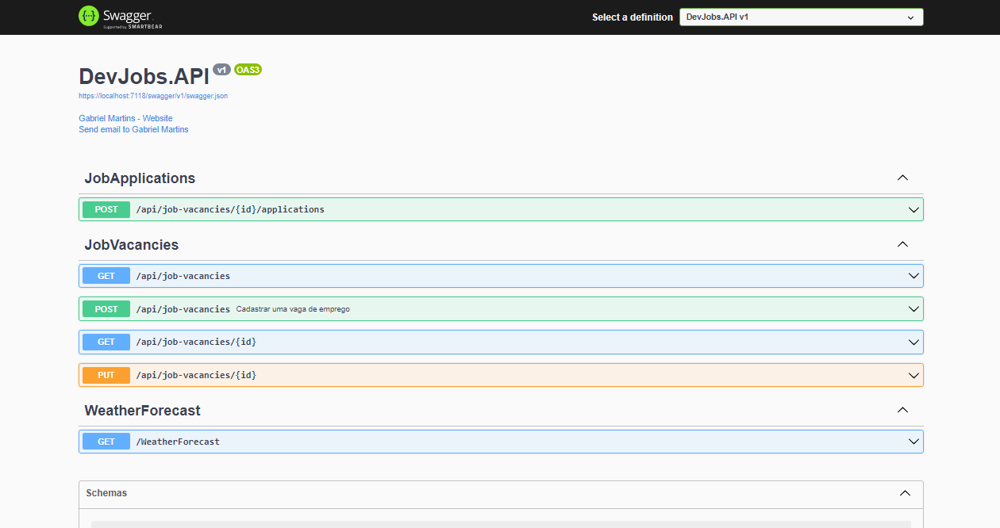

<h1 align="center">Dev Jobs</h1>

 <div align="center">

 
Foi desenvolvida uma API REST em .NET completa do zero,
com diversos endpoints

</div>


 <div align="center">

   <cite align="center">`Aplicação responsável por gerenciar vagas de
emprego de programadores e aplicação de vagas`</cite>

</div>


  <p align="center">

  
 
  

  
 
  

  


  </p>


<h4 align="center"> 
   ✅ Dev Jobs 🔎👨‍💻🌆 Concluido ✅ 
   
 </h4>


## 🔥 **Pré requisitos**

- [SDK do .NET 6](https://dotnet.microsoft.com/download)
- [Visual Studio](https://visualstudio.microsoft.com/pt-br/downloads/)
- [Visual Studio Code](https://code.visualstudio.com/)


## 🚀✔️ Tecnologias e práticas utilizadas
- ASP.NET Core com .NET 6
- Entity Framework Core
- SQL Server
- Documentação de APls com Swagger
- Injeção de Dependência
- Programação Orientada a Objetos
- Padrão Repository
- Clean Code, Logs com Serilog
- Publicação na nuvem Microsoft Azure com Azure App Service

## 🔨🔮 Funcionalidades

- Cadastro, Listagem, Detalhes, Atualização de Vaga de Emprego
- Aplicação a Vaga de Emprego

<hr>

 <div align="center">

   <h3 align="center"><i>Documentaçao da Api</em></h3>
   
   
  <!-- <cite align="center">`http://localhost:3000`</cite> -->
  
   
</div>

## 📝 Pacotes do Nuget e Extensões

<i>

* Microsoft.EntityFrameworkCore -> Para utilizar Entity Framework
* Microsoft.EntityFrameworkCore.Design -> Componentes de tempo de design compartilhado
* Microsoft.EntityFrameworkCore.InMemory -> Para utilizar SQL e Salvar dados em memoria
* Microsoft.EntityFrameworkCore.SqlServer -> Para utilizar Migrations SQL e Salvar dados no BD
* Swashbuckle.AspNetCore -> Para utilizar o Swagger
* Serilog.Sinks.MSSqlServer -> Para utilizar o Logs com BD SQL
* Serilog.AspNetCore -> Para utilizar o Logs no ASP NET
* EntityFramework -> (ORM)
 
 <hr>
 

* C#
* Bracket Pair Colorizer
* C# Extensions
* C# Snippets
* NuGet Gallery
* Azure App Service
* SQL Server (mssql)
* Vscode-icons

Voce pode baixar todas as extensões no [`MarketPlace Visual Studio Code`](https://marketplace.visualstudio.com/vscode)
 
</i>

<br>
 
## Comandos 👨‍💻💻  
```bash

# Para ver uma lista de todos os modelos de projetos
$ dotnet new --list

# Para cria projeto API Web do ASP.NET Core (-o Para mostrar o diretorio de criação)
$ dotnet new webapi -o DevJobs.API

# Para instalar Entity Framework no contexto global
$ dotnet tool install --global dotnet-ef

# Habilitar o armazenamento secreto
$ dotnet user-secrets init

# Para definir um segredo
$ dotnet user-secrets set "(ConnectionString:(nomedobanco)" "string de conexao do sql server"

# Adiciona uma nova migração.
$ dotnet ef migrations add 

# Adiciona uma nova migração | <NAME> | O diretório no qual colocar arquivos
$ dotnet ef migrations add InitialMigration -o Persistence/Migrations

# Atualiza o banco de dados para a última migração ou para uma migração especificada
$ dotnet ef database update
```

 <br>

## Melhorias a fazer:

<details>
  <summary>Fazer documentaçao XML </summary>
 
- [ ] PUT

- [ ] GET

- [ ] GETALL

</details>

<br>

## 🖋️ Dicas

* Atalhos [Snippets de código C#](https://docs.microsoft.com/pt-br/visualstudio/ide/visual-csharp-code-snippets?view=vs-2022)
* Indentar -> ```  ALT + SHIFT + F ```
* Para fazer Using ->  ``` Ctrl + .  ``` 
* O Preenchimento de código com `Ctrl+Space`
* Usar Atalho do IntelliSense  `prop`  -> Para Criar Atributos do Objeto
* Usar atalho `api_controller` -> Para criar a estrutura de controller do arquivo
* Usar atalho `propg` -> Cria uma propriedade implementada automaticamente do tipo somente leitura, com um set private.
* Usar atalho `ctor` -> Cria um construtor para a classe que o contém.


<hr>
<br>

<div align="center">

Feito com ❤️ por [Gabriel Martins](https://www.linkedin.com/in/gabriel-martins-0479811b0/) durante a Jornada .NET Direto ao Ponto do Canal [luis_dev](https://www.youtube.com/channel/UCjfymesWHr0Z-3hryRsc-Fw)👋
 
 </div>
